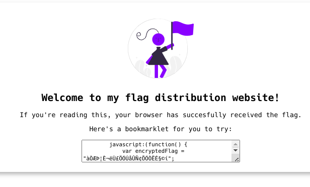

# Giới thiệu
Thử thách: Bookmarklet

Trong thử thách này, bạn sẽ khám phá các lỗ hổng bảo mật do lập trình viên không quản lý kỹ mã nguồn JavaScript, dẫn đến việc tiết lộ thông tin bí mật. Đây là một tình huống phổ biến mà các lập trình viên phải đối mặt, và nhiệm vụ của bạn là tìm ra và khai thác những thông tin này để chiếm đoạt quyền truy cập. Hãy cùng tôi tìm hiểu và giải quyết thử thách này 

# Phân tích và giải quyết 
Trước tiên, hãy cùng tôi khám phá thử thách này. Tôi đã nhận được liên kết đến thử thách tại: http://titan.picoctf.net:49909/. Tôi sẽ bắt đầu bằng cách truy cập vào liên kết này để xem chi tiết và hiểu các yêu cầu cụ thể.

Khi truy cập trang web, bạn sẽ thấy không có nhiều thông tin hiển thị. Tuy nhiên, nếu chú ý, bạn sẽ phát hiện một đoạn mã JavaScript nằm ở giữa trang. Dường như đây là một gợi ý quý giá, bởi trong đoạn mã này, có một thông điệp cờ đã được mã hóa. Nhiệm vụ của chúng ta là giải mã đoạn thông điệp này để lấy được flag.

Tiếp theo, tôi mở trình duyệt web và nhấp chuột phải vào trang, sau đó chọn "Inspect" để mở công cụ phát triển. Đây là một công cụ mạnh mẽ dành cho các lập trình viên và những người kiểm tra bảo mật, giúp kiểm tra và chỉnh sửa mã nguồn của trang web ngay trên trình duyệt.Khi công cụ phát triển đã mở, tôi chọn tab "Console". Tab Console này cho phép chúng ta thực thi mã JavaScript trực tiếp trong ngữ cảnh của trang web. Đây là nơi tôi có thể nhập và chạy các đoạn mã để kiểm tra hoặc khai thác thông tin.

Bây giờ, tôi dán đoạn mã JavaScript đã tìm thấy vào Console và nhấn Enter. Điều này sẽ chạy mã JavaScript và thực hiện các hành động đã được lập trình trong đó. Trong trường hợp này, đoạn mã JavaScript sẽ giải mã thông điệp cờ và hiển thị flag mà chúng ta cần tìm.
