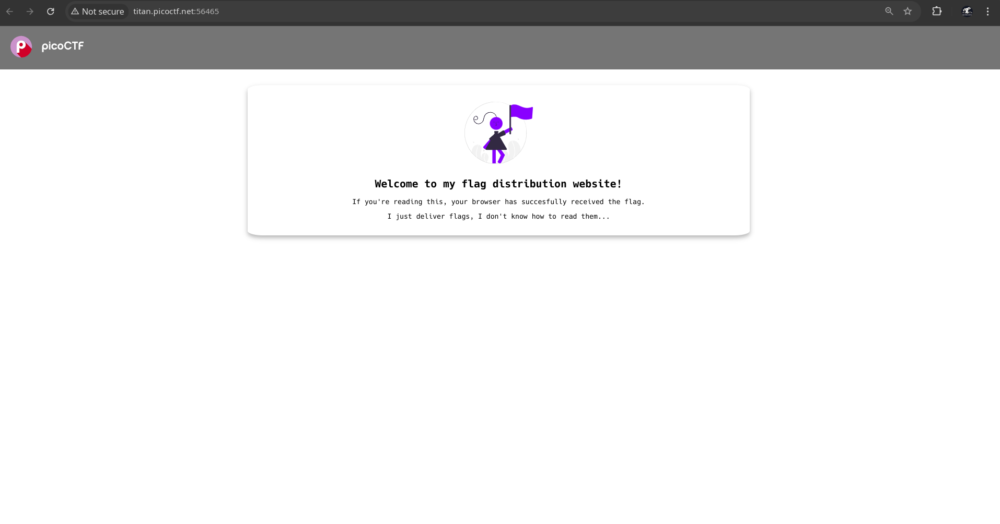
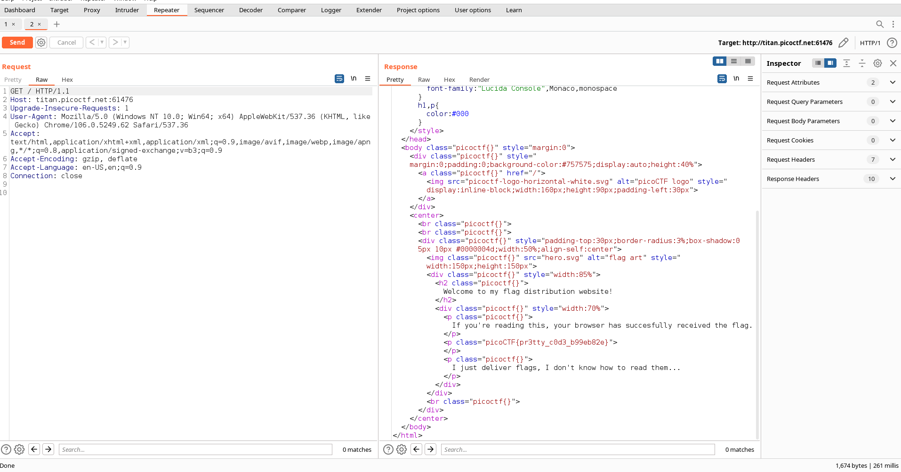

# Giới thiệu 
Thử thách: Unminify 

Trong thử thách này , tôi cần khám phá một cờ ẩn được nhúng trong mã nguồn của một trang web. Thông thường , các nhà phát triển web có thể vô tình để lại thông tin nhạy cảm trong mã nguồn , thông tin này có thể truy cập được khi trang được xem. Nhiệm vụ của tôi là kiểm tra mã nguồn của trang web để tìm cờ vô tình bị lộ trong quá trình triển khai trang .
# Phân tích và giải quyết
Trước tiên,hãy cùng tôi khám phá thử thách này . Tôi đã nhận được liên kết đến thử thách: http://titan.picoctf.net:56465/. Tôi sẽ bắt đầu bằng cách truy cập liên kết này để xem nội dung chi tiết và hiểu các yêu cầu cụ thể .

Theo những gì tôi thấy , thử thách này có vẻ xoay quanh trang chỉ mục , vì dường như không có trang nào khác để khám phá. Hãy tập trung nỗ lực của chúng ta vào trang chính này . Khi xem xét kỹ hơn , tôi nhận thấy một gợi ý được nhúng trong chính trang web , gợi ý rằng chúng ta nên tìm kiếm manh mối ngay tại đây. 
                                                                                                                 

Tiếp theo , tôi quyết định sử dụng BurpSuite để phân tích chi tiết hơn về trang web. Bằng cách kiểm tra mã nguồn , có thể thấy rõ rằng cờ đã vô tình được nhà phát triển đưa vào . Sự giám sát này xảy ra trong quá trình yêu cầu POST , khiến cờ được nhúng trong mã và hiển thị khi kiểm tra.picoCTF{...} 

